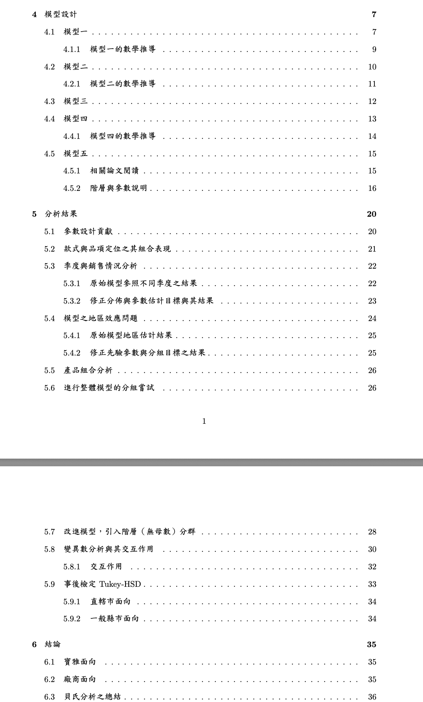
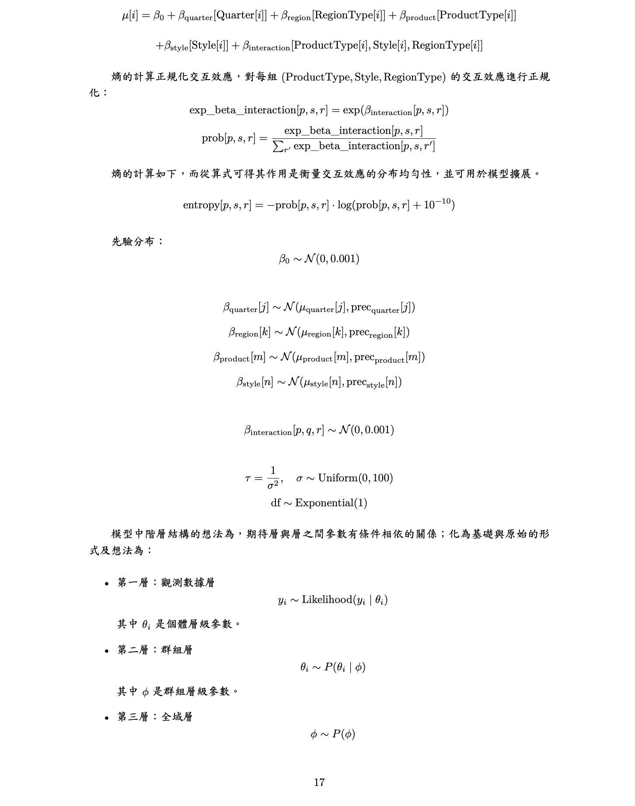
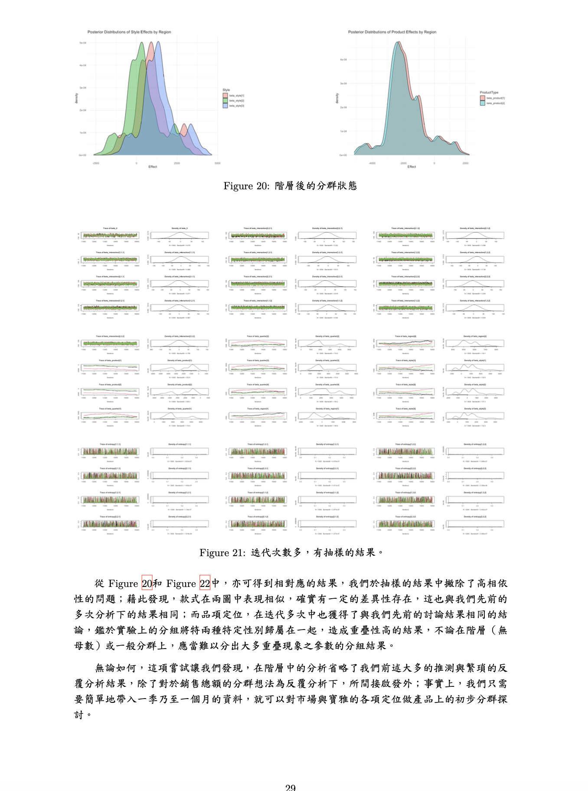
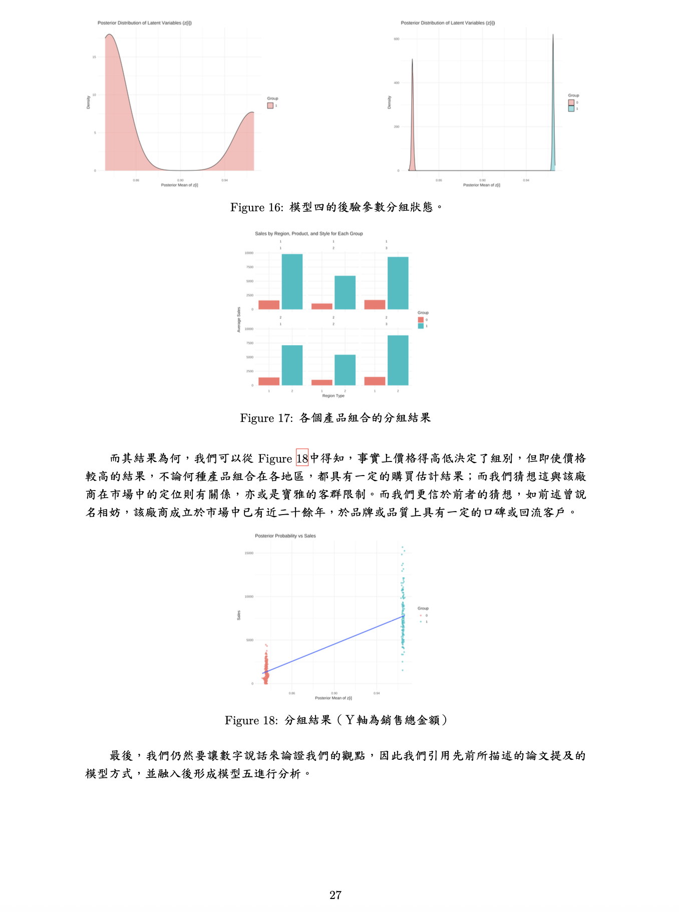

# 1131 貝氏資料分析－學碩合開
基於貝氏階層（非參數）模型之分群－寶雅數據為例與統計學派比較。

使用的工具（r jags）：

我在這份研究中，建立五種模型，其中包含：
- 貝氏潛在類別分析
- 貝氏階層線性模型
- 引入階層（無母數）分群

***

## 摘要

研究旨在利用貝氏階層模型探討零售業銷售數據中的分群結構，並比較統計學中貝
氏學派與頻率學派的分析結果。以寶雅銷售數據為例，我們分析不同地區與季度下的產品
組合與銷售模式，特別觀察款式與品項定位的交互影響。研究方法包括基於中國餐廳過程
的貝氏非參數分群方法，結合階層貝氏線性模型，分析因子間的交互作用對銷售表現的影
響。本研究進一步探討模型先驗分布的設置與假設修正，並延伸至統計學派之變異數分析
實驗結果比較，評估兩種學派在分群結果上的差異與管理應用，與其中給予相對應的商業
策略為目標。研究結果亦期望為台灣零售業提供創新的管理策略或意涵，並以貝氏為主軸
作為核心驅動的優化管理經營建議。

## 研究目的

找出不同地區及季度的產品最佳組合。觀察在款式這項因子下，各個產品的銷售狀
況與分佈是否相似。期待看出品項定位與款式的組合下，每組的銷售狀況的分組的情形；
並藉此延伸在不同季度當中去比較與觀察，每季的銷售狀況（款式與品項定位之組合中）
是否類似。

將先使用貝氏資料分析的方式，觀察款式在不同地區與季度中的銷售表現。並藉此
作為基底模型延伸與修正，更動先驗分佈的參數與假設，並透過貝氏分群方法（基於中國
餐廳過程和多項分布），對款式與品項定位的銷售表現進行分群。最後，應用階層貝氏線
性模型分析因子（參數）間的交互作用與關係，對銷售總金額的影響。

## 模型五

「利用貝氏理論於旅行時間推估之研究」，其中主要提及貝氏更
新方法的概念，將歷史資料視為先驗資訊，假設其服從常態分配。而即時速度資料作為觀察值，
通過貝氏更新修正歷史速度資料。即利用HDP的概念與中國餐廳過程的想法，將資料點類比為顧客進入餐廳選擇座位的行為，客人可選擇已有的桌子或新的桌子。

設立其貝氏階層模型，將其核心觀測值，包含熵的計算，即透過對交互效應進行正規化以推導概率分布。

## 結果與小節

事實上，我們可以優雅地用這簡單的貝氏估計，得到與變異數分析中相似的答案，並且給
予對應的商業策略，如我們亦可從品項定位的重疊結果，推薦寶雅或廠商將品項定位往中性發
展；我們亦可從款式的因子在分群的結果中，推薦廠商可以重新審視自動扣所熱賣的縣市或地
區，因為分群結果下販售狀況不算均勻等。

最後，我們其實可以藉由貝氏估計的先驗分佈與 Likelihood 的估計，節省大量的時間成本
來滿足現今已顧客至上，且以無母數的快速分組，使其相對即時的方式來為每一季乃至每一個
月進行分組推估；而在實現這一切的前提為市場與社會氛圍願意為這些，雖有一定的品牌與品
質的台灣在地製造的「夕陽產業」，接納與打造起「再昇產業」。

